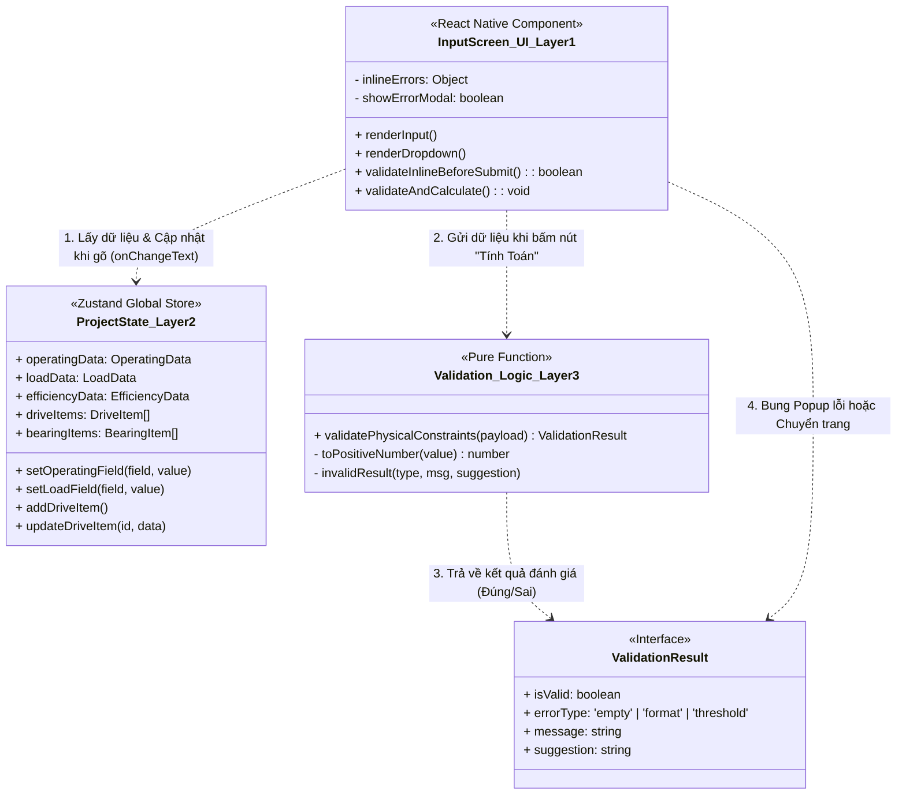

```mermaid
classDiagram
    direction TB

    %% Định nghĩa các lớp và Module
    class InputScreen_UI_Layer1 {
        <<React Native Component>>
        - inlineErrors: Object
        - showErrorModal: boolean
        + renderInput()
        + renderDropdown()
        + validateInlineBeforeSubmit() : boolean
        + validateAndCalculate() : void
    }

    class ProjectState_Layer2 {
        <<Zustand Global Store>>
        + operatingData: OperatingData
        + loadData: LoadData
        + efficiencyData: EfficiencyData
        + driveItems: DriveItem[]
        + bearingItems: BearingItem[]
        + setOperatingField(field, value)
        + setLoadField(field, value)
        + addDriveItem()
        + updateDriveItem(id, data)
    }

    class Validation_Logic_Layer3 {
        <<Pure Function>>
        + validatePhysicalConstraints(payload) ValidationResult
        - toPositiveNumber(value) number
        - invalidResult(type, msg, suggestion)
    }

    class ValidationResult {
        <<Interface>>
        + isValid: boolean
        + errorType: 'empty' | 'format' | 'threshold'
        + message: string
        + suggestion: string
    }

    %% Luồng tương tác
    InputScreen_UI_Layer1 ..> ProjectState_Layer2 : 1. Lấy dữ liệu & Cập nhật khi gõ (onChangeText)
    InputScreen_UI_Layer1 ..> Validation_Logic_Layer3 : 2. Gửi dữ liệu khi bấm nút "Tính Toán"
    Validation_Logic_Layer3 ..> ValidationResult : 3. Trả về kết quả đánh giá (Đúng/Sai)
    InputScreen_UI_Layer1 ..> ValidationResult : 4. Bung Popup lỗi hoặc Chuyển trang
```
